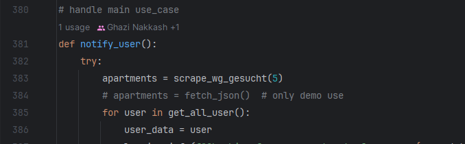

# Flat Finder Doc

## Overview

- **Project Name:** Flat Finder
- **Project Description:** Tool for finding shared apartments using user preferences and shared-apartments descriptions.
- **Data Source:** Scraping wg-gesucht using Selenium.
- **Approach:** Unfiltered scraping, temporary storage in a JSON file, structural and deep filtering, recommendation generation.
- **Tools:** Selenium, MongoDB, GPT-3.5, Telegram.

## Components

- [Selenium scrapper](src/BE/wg_gesucht_scraper.py)
- [mongoDB](src/mongo/user_db.py)
- [Telegram Bot](src/FE/app.py)
- [OpenAI Agent](src/setup_assistant/agent.py)

### Use-Cases:

- Profile creation and update.
- Preference setting.
- WG recommendations (active and passive).

## Workflow

- **Creating User:** User will be created in [UI](src/FE/app.py) and preferences will be set. 
- **Scraping:** Collecting data from wg-gesucht using [selenium](src/BE/wg_gesucht_scraper.py). 
- **Storage:** Temporary storage in a [JSON file.](src/BE/output.json)
- **Filtering:** Apartments data will be [filtered](src/BE/structural_filtering.py) for the user.
- **Recommendation:** Deep filtering with non-structural data, generating [recommendation](src/BE/ai_recommendation.py) for user and an example application text.
- **UI notification:** [Notifying](src/FE/app.py) the user of the recommendation and example application.

## [Experimentation](prompt_experiments.md)

---
## Setup

1. **Download Telegram on your [Smart phone (IOS)](https://apps.apple.com/us/app/telegram-messenger/id686449807) or [Desktop (windows)](https://apps.microsoft.com/detail/9nztwsqntd0s?launch=true&mode=full&hl=en-gb&gl=de&ocid=bingwebsearch)**
2. Create an account in Telegram.
3. setup your **env. file** to the flat finder Folder:
4. **Install the requirements:**
      ```bash
      pip install -r requirements.txt
      ```
5. **Run the Agent:**
      ```python
         python main.py
      ```
6. **Run the Telegram Bot:**
      ```python
        python src/FE/app.py
      ```
6. **Start the conversation with the [FlatFinderHTWBot](https://t.me/search_flat_bot):**
   1. Start a Chat with the bot using this [link](https://t.me/search_flat_bot).
   2. Klick on the start button or send **/start**.
   3. send **/profile** to set up your profile and preferences.

### congrats you are ready to go!

---
### Testing:
1. uncomment the Line 384 in [FE/app.py](src/FE/app.py).
   ```python
   # response = agent.get_response(user_id, message)
   ```:

2. use this example user Data for creating your profile
   ```json
     {
       "average_monthly_net_income": 2000,
       "date_of_birth": "2000-01-01",
       "email": "test@test.com",
       "employment_type": "Student",
       "full_name": "John Doe",
       "phone_number": "1245",
       "smoker": false
       "additional_info": ["balcony", "peaceful"],
       "address": {
         "street": "Seidelbastweg",
         "house_number": 1,
         "zip_code": 12357,
         "city": "Rudow",
         "country": "Germany"
       },
       "apartment_preferences": {
         "max_rent": 600,
         "location": "Berlin",
         "bezirk": ["Mitte", "Friedrichshain", "Rummelsburg", "Wedding", "Kreuzberg"],
         "min_size": 20,
         "ready_to_move_in": "2024-06-01",
         "preferred_roommates_sex": "gender_irrelevant",
         "preferred_roommate_age": [20, 30],
         "preferred_roommate_num": 3,
         "smoking_ok": false
       }
     }
   ```
3. this will make sure that you receive a static listing stored in the [output.json](src/FE/output.json) file.